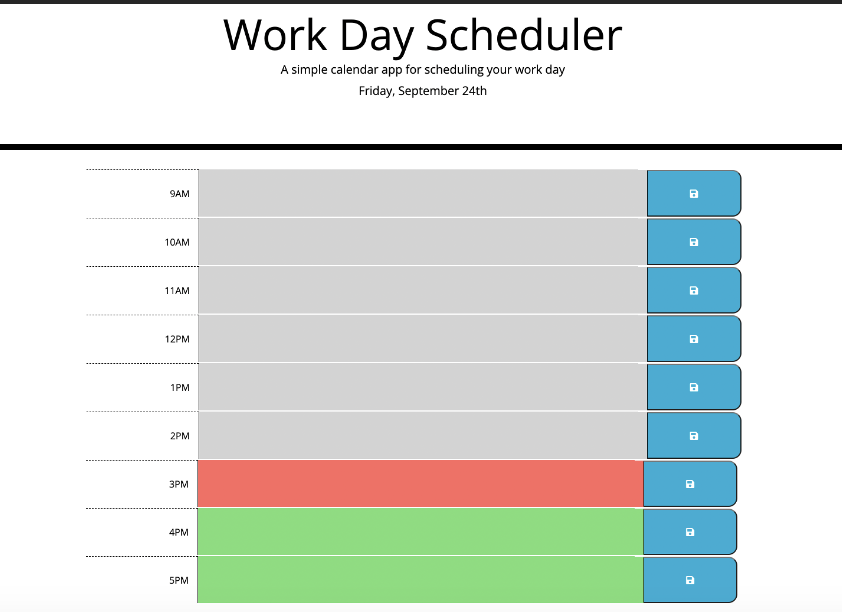
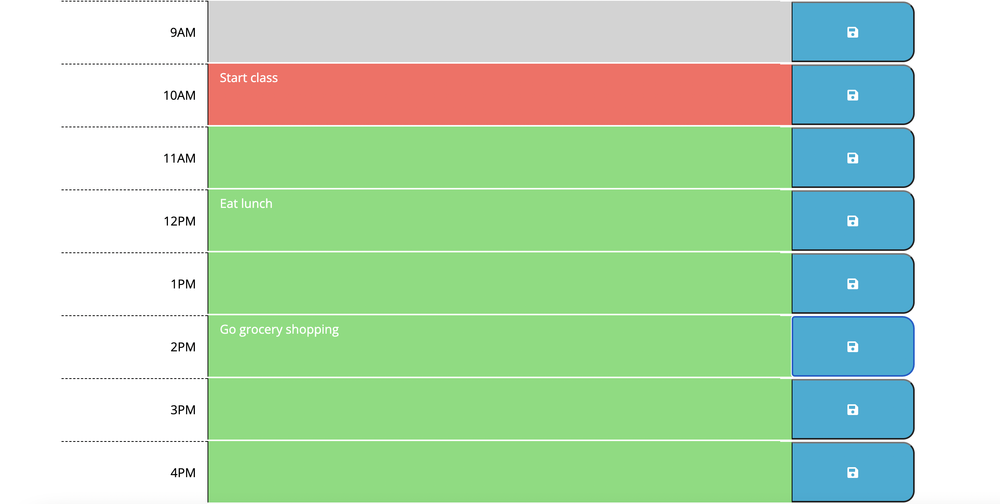

# Daily-Planner

This daily planner allows a user to plan out his or her day during normal work hours by writing tasks for themselves. Displayed with the current date at the top, the planner will also dynamically update by color based on the hour of the day to show past, present and future time.

# Features and Functionality

Below is a visualization of the daily planner.

The planner updates daily with the current day, month, and date. The user sees time blocks from 9AM - 5PM where they can type tasks for themselves to do. Once the save button is pressed in each time block, the content will be stored on the page until updated even upon refresh of the screen. Each hour, the hour block is updated by color to represent past, present and future time.

Click the following link to view an animation of the webpage. https://watch.screencastify.com/v/FilIbr5GJbYdtOjNMWoE

# Deployment Access

https://cianfich1016.github.io/Daily-Planner/
# License

Library can be found at the following link.

https://github.com/cianfich1016/Daily-Planner

Initial starter code borrowed from Trilogy Education services.

This project is licensed under the terms of the MIT license.